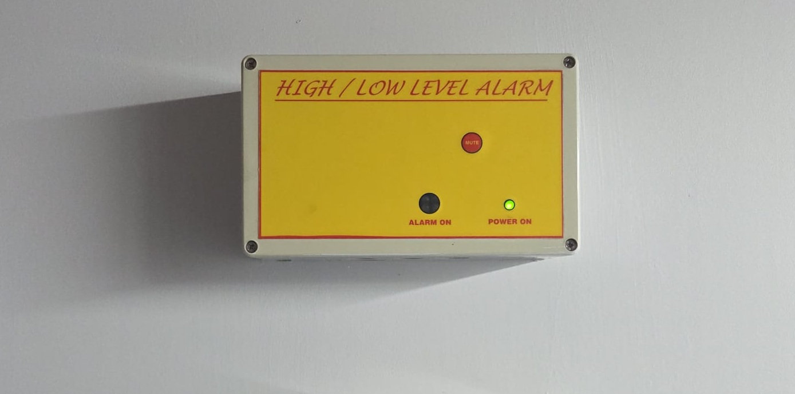
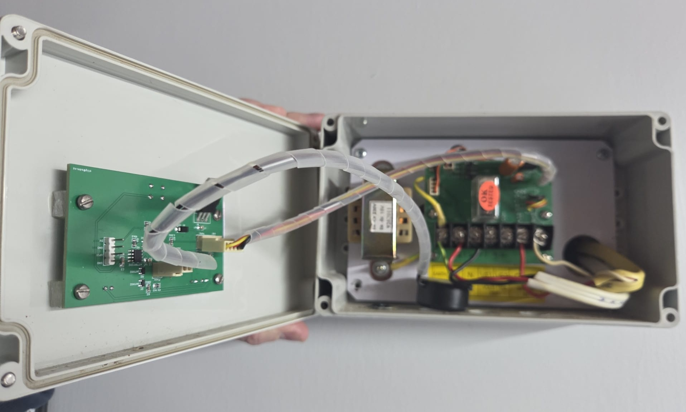
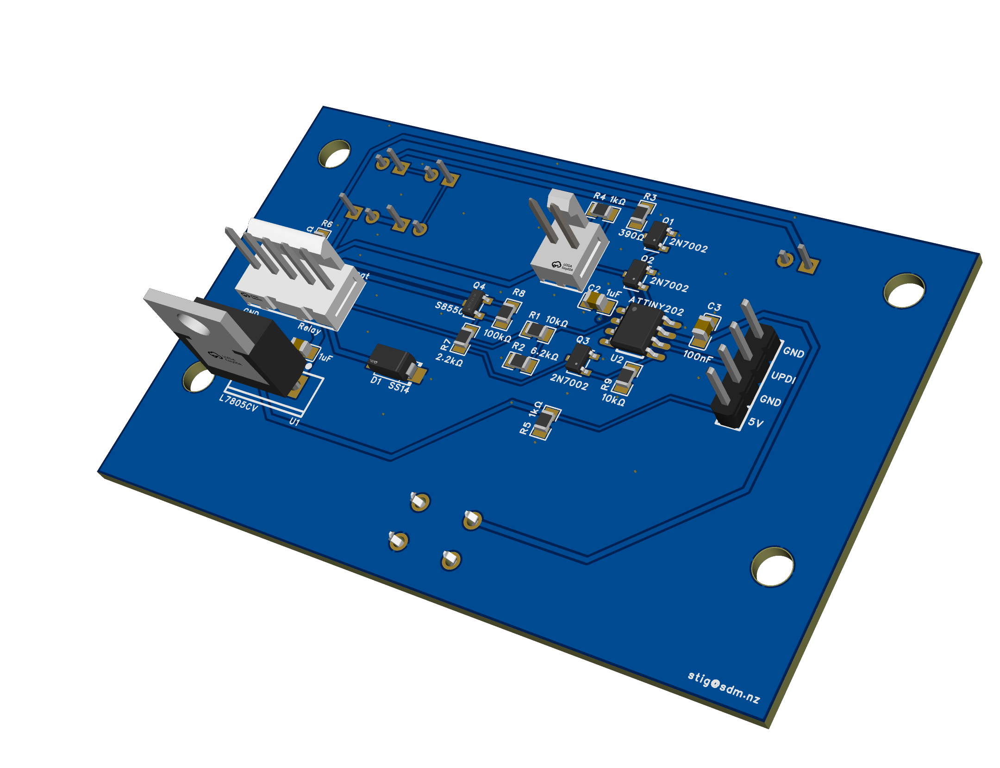
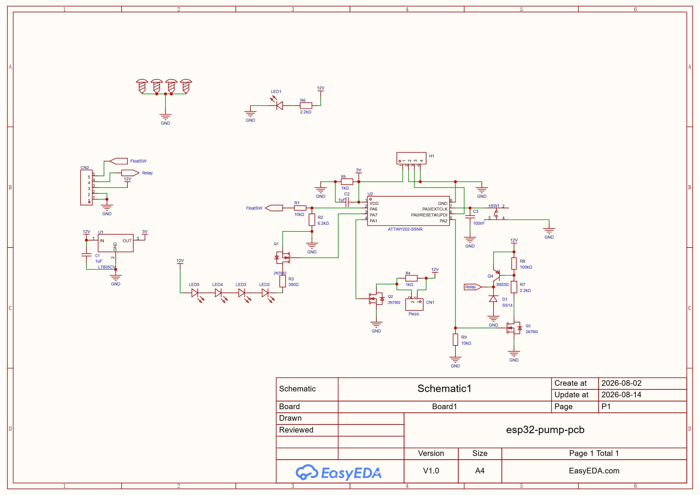
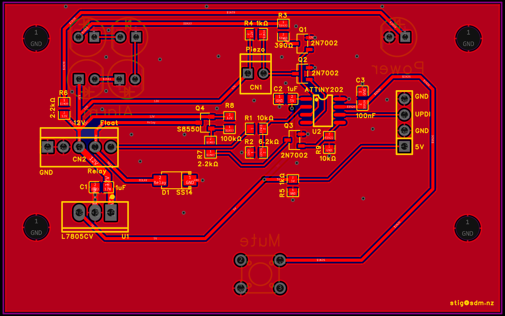
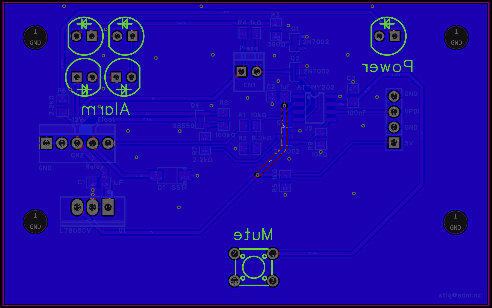
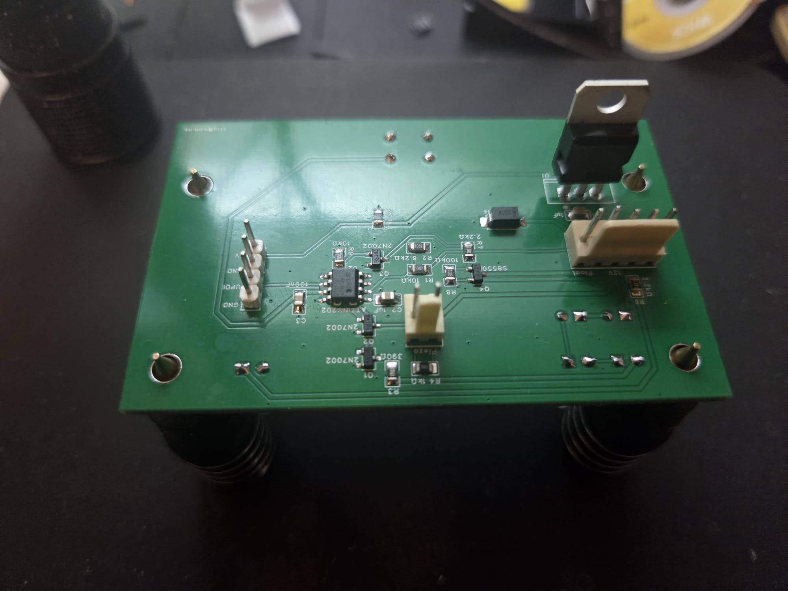
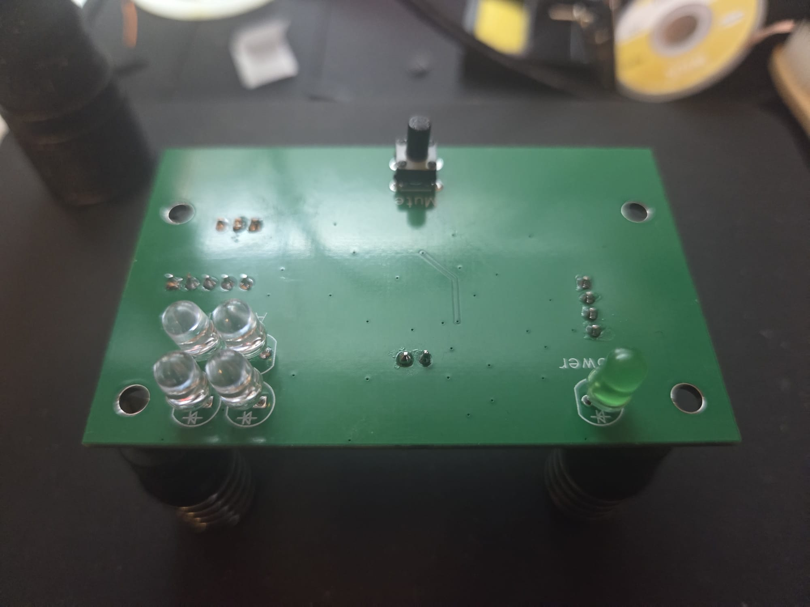

# Replacement PCB for Wallace High Low Level Alarm (1950610)





Basic Arduino controlled replacement PCB for Wallace High Low Level Alarm (1950610): watch FLOAT_SW, flash four LEDs at 2 Hz while it is high, sound
a 4 kHz piezo once it has been high for 5 seconds, and drive the pump relay
on CN2-4.

This board allows replacement of a failed PCB since the alarm unit retails for $500NZD.

**28 components, 20 BOM lines.** One 8-pin microcontroller (ATtiny202)
replaces every timer, oscillator and delay circuit on the existing discrete circuit design.



## 1. Scope and constraints

| | |
|---|---|
| Controller | ATtiny202 (SOIC-8) — 5 s delay, 2 Hz flash, 4 kHz tone and relay logic in ~40 lines of firmware |
| Supply | 12 VDC on CN2-3 |
| CN2-4 RELAY_OUT | **Out** — sources +12 V to the external relay coil (coil's far end is grounded in the harness) |
| Isolation | None — shared ground, same as the original board |

## 2. Connector pinout

**CN1 — 2-pin friction-lock, top edge. Piezo sounder.**

| Pin | Net | Notes |
|-----|-----|-------|
| 1 | +12 V | Fed from the board's 12 V rail — **same as the original board** |
| 2 | PIEZO_LO | Switched to GND by Q2 at 4 kHz |

Works with either sounder type, like the original board: a **passive piezo
element** (e.g. Murata PKM13EPYH4000, 4 kHz resonant) driven by 4 kHz PWM,
or an old-style **self-drive 12 V siren** (hold the gate high). A
**magnetic buzzer** would additionally need a flyback diode across CN1 —
fit a passive piezo and it's not needed.

**CN2 — 5-pin friction-lock, left edge.**

| Pin | Net | Direction | Notes |
|-----|-----|-----------|-------|
| 1 | GND | — | |
| 2 | GND | — | |
| 3 | +12 V | **In** | Board supply |
| 4 | RELAY_OUT | **Out** | Sources +12 V to the relay coil via Q3. Coil's other end is wired to GND externally. |
| 5 | FLOAT_SW | **In** | +12 V when float closed, open circuit when open. R1/R2 divider is the required pull-down. |

## 3. Block diagram

```
 CN2-3 +12V ──┬── C1 1µF ── GND (at U1 IN pin)
              │
              ├──▶ IN  U1 L7805CV  OUT ──┬─────────▶ VDD (5.0 V)
              │            │             ├─ R5 1k ── GND (min-load bleed)
              │           GND            └─ C2 1µF ─ GND
              │
              ├──[R6 2.2k]──▶|── GND    LED1 power (always on)
              │
              │  LED2 3  4  5                   ┌──────────────┐
              ├──▶|──▶|──▶|──▶|──[R3 390]─┐     │   ATtiny202  │
              │                           │drain│              │
              │                    Q1 2N7002 ◀──┤ PA7          │
              │                           └─GND │              │
              │                                 │              │
              ├────────────────────▶ CN1-1      │              │
              ├──[R4 1k]──┬────────▶ CN1-2      │              │
              │           │drain                │              │
              │    Q2 2N7002 ◀── gate ──────────┤ PA1          │
              │           └─GND                 │              │
              │                                 │              │
              └─[R8 100k]─┬── Q4 S8550 (PNP)    │              │
                     base ├── emitter ── +12V   │              │
                          │   collector ─┬▶CN2-4│              │
                       R7 2.2k           │      │              │
              Q3 2N7002 ──┤   GND ▶|── D1 SS14  │              │
              (drain)     │                     │              │
              gate ◀──────┼─────────────────────┤ PA2          │
              (R9 10k ▼ GND, source ── GND)     │              │
                                                │              │
 CN2-5 FLOAT ──[R1 10k]──┬──────────────────────┤ PA6          │
                         │                      │              │
                     R2 6.2k ── GND             │              │
                                                │              │
 SW1 mute ── GND, other side ───────────────────┤ PA3 (pullup) │
                                                │ PA0 = UPDI ──┼─▶ H1.3
 CN2-1/2 GND ────── board GND plane             └──────────────┘
```



## 4. Power — L7805CV linear regulator

The L7805CV gives a solid regulated rail from the same three BOM lines
(reg + two caps) plus one extra resistor.

```
CN2-3 ──┬───▶ IN   U1 L7805CV   OUT ──┬──────┬───▶ VDD (5.0 V)
        │        (TO-220, tab=GND)    │      │
     C1 1µF            │            R5 1k   C2 1µF (at MCU pin)
   (at IN pin)        GND             │      │
        │                            GND    GND
       GND
```

Checked against the ST datasheet (DS0422 rev 38, en.CD00000444.pdf in this
repo):

- **Input range:** abs max **35 V** — 12 V nominal and a 13.8 V
  float-charged rail aren't even close. Dropout is 2 V (specced at 1 A, less
  at our few mA), so the board regulates down to a ~7 V rail.
- **Output:** 4.8–5.2 V at 25 °C, 4.75–5.25 V across line/load/temperature.
- **R5 is not optional:** Table 10 note — *"Minimum load current for
  regulation is 5 mA."* The ATtiny draws only ~2–3 mA, and ~0.1 mA in
  reset, so without a bleed the output can drift out of spec at light load.
  R5 (1 kΩ) burns a fixed 5 mA and guarantees the minimum in every state,
  including during UPDI programming. (25 mW — any 0805.)
- **Caps, per the datasheet, not habit:**
  - *Input* (C1): the 12 V arrives over the enclosure harness, i.e. the
    regulator *is* "an appreciable distance from the power supply filter",
    so the input bypass is required — and §6.1 specifies its type: 0.33 µF
    or larger with **"low internal impedance at high frequencies"**,
    mounted directly at the IN pin. That means ceramic/film — an aluminum
    electrolytic fails this requirement. C1 = 1 µF X7R at the pin.
  - *Output* (C2): not needed for stability at all — the 7805 is internally
    compensated (*"no output capacitor is needed for stability, but it does
    improve transient response"*, §6.1 Figure 8). C2 = 1 µF X7R at the
    MCU's VDD pin. (The piezo now runs off 12 V, so the 5 V rail sees only
    gentle loads — 1 µF is ample.)
  - C1 and C2 are the same part — one BOM line, two placements.
- **Quiescent current:** up to 8 mA to ground regardless of load. Board
  draw from 12 V: ~30 mA logic/LEDs, ~12 mA piezo drive while sounding,
  plus the external relay coil (~40 mA) through Q3 — none of the 12 V loads
  touch the regulator. ~0.1 W in the TO-220 (50 °C/W), no heatsink; the tab
  is GND.
- **Pinout (TO-220, facing the label):** 1 = IN, 2 = GND, 3 = OUT. Note
  this is the **78xx** pinout — a 79xx negative regulator has GND on pin 1
  and *will* die here, and the packages look identical.
- **Clock:** the firmware runs at **20 MHz internal** — megaTinyCore
  programs the prescaler to match the Tools ▸ Clock selection (the chip
  does *not* stay at the factory OSC20M ÷ 6 default).
- **BOD:** with VDD ≥ 4.75 V guaranteed, **BODLEVEL7 (trips ≤ 4.5 V)** is
  usable and recommended — it catches a failing regulator before logic
  misbehaves.

LED1 (power) and the LED2–5 string run **directly off 12 V**, not through
the regulator, so they don't load it (and LED1 keeps indicating +12 V
presence even if the regulator dies, per the spec).

## 5. Float switch input (CN2-5 → PA6)

```
CN2-5 ──[R1 10k]──┬──▶ PA6
                  │
               R2 6.2k
                  │
                 GND
```

- The divider **is** the required pull-down: open float → PA6 held at GND.
- 12 V × 6.2/16.2 = **4.59 V** — above worst-case V_IH (0.7 × 5.25 V max
  VDD = 3.68 V) with margin. Works down to a ~10 V rail.
- On a 13.8 V float-charged supply the node sits at 5.28 V — still below
  VDD + 0.5 = 5.5 V, so with the regulated rail the pin clamp never even
  conducts. (Above a ~14.4 V rail it would, but the divider's ~3.8 kΩ
  Thevenin impedance keeps injection far inside the datasheet's ±1 mA
  allowance, Table 33-1 Ic1.) No clamp diode needed.
- No RC filter: debounce is 50 ms in firmware, where it's free.

## 6. Power LED (LED1)

```
+12V ──[R6 2.2k]──▶|── GND      LED1 red 5 mm (XL-502SURC), ~4.5 mA, always on
```

Straight off the rail — lights whenever 12 V is present, MCU dead or alive.
**Must connect to 12 V, not 5 V** — on 5 V it would only report "regulator
alive" and drop to a dim 1.4 mA.

## 7. Flash string LED2–LED5 (PA7 → Q1)

Four series red LEDs need ~8 V, more than the 5 V rail, so the string runs
from 12 V through a low-side FET:

```
+12V ──▶|───▶|───▶|───▶|──[R3 390Ω]──┬
      LED5 LED4 LED3 LED2            │ drain
                                 ┌───┴───┐
                                 │  Q1   │ 2N7002
                                 └───┬───┘
                       PA7 ── gate   │ source ── GND
```

- (12 − 4×2.0)/390 ≈ **10 mA** through the string.
- Gate driven directly from PA7 — no series or pull-down resistor. During
  reset and UPDI programming the gate floats; worst case the string glows,
  which is harmless. (A 100 k gate pull-down footprint is a cheap DNP option
  if that offends.)

## 8. Piezo (PA1 → Q2 → CN1)

One pin, switched from the 12 V rail — the original board's own topology,
which frees PA2 for the relay and gives **12 Vpp** across the element
(vs 10 Vpp for the old two-pin differential drive):

```
+12V ──┬──────────────────▶ CN1-1
       │
     R4 1k
       │
       ├──────────────────▶ CN1-2   PIEZO_LO
       │ drain
   ┌───┴───┐
   │  Q2   │  2N7002
   └───┬───┘
 gate  │ source ── GND
PA1 ───┘
```

- PA1 drives Q2's gate with 4 kHz PWM; Q2 chops CN1-2 between GND and
  (via R4) 12 V. The element sees a 12 Vpp square.
- **R4 (1 kΩ)** is the pull-up/discharge path: a piezo is a capacitor, and
  without R4 the drain node would just stay wherever Q2 left it. τ =
  1 k × 15 nF ≈ 15 µs against a 125 µs half-period — crisp edges. It burns
  12 mA only while Q2 conducts (~6 mA average during alarm, from the 12 V
  rail, not the regulator).
- **Boot-safe without a gate pull-down:** if the gate floats high during
  reset/UPDI, Q2 just holds the node at DC — a piezo element passes no DC
  and stays *silent*. (A magnetic buzzer would buzz and need the flyback
  diode; fit a passive piezo element as specced.)
- No series pin resistor needed anymore — PA1 sees only Q2's gate, and the
  element can no longer inject into an MCU pin when knocked.

## 9. Relay output (PA2 → CN2-4)

CN2-4 must **source** +12 V into the externally-grounded coil, so this is a
high-side switch — and a 5 V GPIO can't pull a P-FET gate down from 12 V,
hence the level shifter. Lifted from the original design's §6:

```
                               +12V
                                │
                         R8 100k│ (base-emitter pull-up)
                                ├──────────┐
                                │       ┌──┴──┐ emitter
                                ├─base──┤ Q4  │  SS8550 (PNP)
                                │       └──┬──┘
                             R7 2.2k       │ collector
                                │          ├──────▶ CN2-4  RELAY_OUT
                          drain │          │
                         ┌──────┴┐     D1 SS14  (cathode ▶ CN2-4, anode ▶ GND)
                         │  Q3   │         │
                         │ 2N7002│        GND
                         └──┬────┘
                       gate │ source ── GND
              PA2 ──────┬───┘
                        │
                     R9 10k
                        │
                       GND
```

- **Q3** (2N7002) sinks Q4's base current through R7 → Q4 saturates →
  CN2-4 gets ~11.9 V (V_CE(sat) is small at 40 mA; any 12 V relay is fine).
- **R7 (2.2 k)** sets the base drive: (12 − 0.7)/2.2 k ≈ 5 mA, a forced
  beta of ~8 at a 40 mA coil — hard saturation. (Same value as R6 — shared
  BOM line.) The 5 mA flows only while the relay is on.
- **R8 (100 k)** ties base to emitter so Q4 is firmly off when Q3 is off.
- **R9 (10 k) is the boot-safety resistor — not optional.** ATtiny pins
  float during reset, brownout and UPDI programming; R9 holds Q3's gate low
  so **the relay cannot energise until firmware runs**. (The LED string and
  piezo get away without pull-downs; a pump does not.)
- **Q4 spec is uncritical** — the SS8550
  (−25 V, −1.5 A) has huge margin; any small PNP with **I_C ≥ 200 mA and
  V_CEO ≥ 25 V** substitutes (BC327, 2N2907, BC807, 2N3906).
- **D1** is the coil flyback diode. The coil hangs between CN2-4 and
  external GND, so a diode from GND (anode) to CN2-4 (cathode) is
  electrically across the coil: when Q4 opens, the coil pulls CN2-4 negative
  and D1 catches it at −0.4 V.
  **Get this orientation right — it is not a "wrong polarity, no clamp"
  failure.** Reversed, D1 is a forward diode from Q4's collector to ground:
  the first time the relay engages it shorts the 12 V rail and destroys Q4.
- Coil current (~40 mA for a typical 12 V relay) comes straight off the
  12 V entry — size that trace accordingly; it never touches the regulator.

## 10. Mute button (SW1 → PA3)

One tactile switch from PA3 to GND — no external resistor, the ATtiny's
internal pull-up (PORTA.PIN3CTRL.PULLUPEN) does that job:

```
PA3 ──┬── SW1 ── GND        (internal pull-up enabled in firmware)
      │
   C3 100nF (at the PA3 pin — see below)
      │
     GND
```

- Press toggles mute of the **piezo only**; the LED string keeps flashing,
  so the flashing-without-sound state doubles as the "muted" indicator.
  **Mute never affects the relay** — silencing the noise must not stop the
  pump.
- Mute auto-clears when the float drops: the next alarm event sounds again.
  A silenced alarm that stays silenced forever is how tanks overflow.
- SW1 wired diagonally (pins 1↔4), so any 6 mm tact's internal pairing
  works. Board-mounted; swap for a 2-pin header to panel-mount if the lid
  should stay closed.
- **C3 (100 nF) is noise/ESD suppression, not debounce** — debounce stays
  in firmware (20 ms), same policy as the float input. It's fitted because
  the layout puts ~63 mm of trace between SW1 and PA3: a ~35 k
  internal-pull-up node that long, on a board carrying a 12 Vpp 4 kHz
  piezo square and relay edges, deserves a hard bypass. With the pull-up it
  forms τ ≈ 3.5 ms — invisible next to the debounce window.
- **C3 sits at the MCU end** (the PA3 pin), where it protects the pin; at
  the button end it would leave the trace as an unterminated antenna.
- **Layout:** route the SW1 run away from the CN1/piezo and Q4 collector
  traces, ground pour alongside. C3 is the backstop, not a substitute.

## 11. Pin assignment (ATtiny202, SOIC-8)

Every I/O is used; the pin budget closes exactly.

| Pin | Port | Net | Dir |
|-----|------|-----|-----|
| 1 | VDD | +5V | — |
| 2 | PA6 | FLOAT_SW | In |
| 3 | PA7 | LED string gate (Q1) | Out |
| 4 | PA1 | PIEZO gate (Q2), 4 kHz PWM | Out |
| 5 | PA2 | RELAY (Q3 gate) | Out |
| 6 | PA0 | UPDI | — (TP1 programming pad) |
| 7 | PA3 | MUTE_BTN | In (internal pull-up, active low) |
| 8 | GND | GND | — |

Programming: **H1, a 4-pin 2.54 mm header — 1 = 5 V, 2 = GND, 3 = UPDI,
4 = GND.** One wire plus power; any serial adapter with a resistor programs
it.

## 12. Firmware

The firmware lives in [`firmware/firmware.ino`](firmware/firmware.ino) and
builds with the Arduino IDE plus
[megaTinyCore](https://github.com/SpenceKonde/megaTinyCore) (Spence Konde).
Everything runs from a 1 kHz main loop paced by the RTC-based `millis()` —
no interrupts, no blocking delays.

**Installing the core:** follow the
[megaTinyCore installation guide](https://github.com/SpenceKonde/megaTinyCore/blob/master/Installation.md)
— add `http://drazzy.com/package_drazzy.com_index.json` to *File ▸
Preferences ▸ Additional Boards Manager URLs*, then install **megaTinyCore
by Spence Konde** from *Tools ▸ Board ▸ Boards Manager*. (Not the
similarly-named [ATTinyCore](https://github.com/SpenceKonde/ATTinyCore) —
that core targets the classic ATtiny25/45/85-era parts; the ATtiny202 is a
modern 0-series tinyAVR and needs megaTinyCore.)

**Build settings (Tools menu):** Board *ATtiny202/402/204/404*, Chip
*ATtiny202*, Clock *20 MHz internal*, **Millis timer: RTC** (required — the
sketch takes over TCA0 for PWM and a compile-time guard rejects any other
setting; `micros()` is unavailable and unused), BOD *4.5 V* (level 7).

**Behaviour:**

| Condition | Action |
|-----------|--------|
| Float closes (debounced 50 ms) | LED string flashes at ~2 Hz immediately |
| Float closed ≥ 2 s | Relay energises (CN2-4 sources +12 V to the pump) |
| Float closed ≥ 5 s | Piezo alarm sounds (unless muted) |
| Mute press (debounced 20 ms) | Toggles piezo only — relay and LEDs unaffected |
| Float opens | LEDs and piezo stop, mute auto-clears; relay honours a 5 s minimum run so slosh can't chatter the contactor |

**Alarm signal** — not a constant tone. The piezo is driven by TCA0 in
16-bit single-slope mode (WO1 on PA1, 50 % duty) with two layers of
modulation:

- **Warble:** the frequency sweeps 0.85 × F_RES → 1.15 × F_RES over 150 ms
  and back (300 ms per cycle), crossing the element's resonant frequency on
  every sweep. `F_RES` defaults to 4000 Hz (Murata PKM13EPYH4000); measure
  and adjust for your element. PER endpoints are computed at runtime from
  `F_CPU`, and PER/CMP1 are double-buffered so sweep updates never glitch
  the output.
- **Temporal:** 3000 ms of warbling, then 300 ms of silence. The onset
  after each silence is much harder to tune out than a continuous tone.

**Safety:**

- All outputs are driven LOW in `setup()` before anything else; R9 keeps
  the relay off in hardware until then.
- Watchdog (1 s timeout) resets the MCU if the loop hangs — a hung MCU
  can't leave the pump energised for more than a second.
- BOD (4.5 V) stays active in sleep, so a sagging rail causes a clean
  reset instead of undefined behaviour on the relay pin.
- Mute never gates the relay, and mute auto-clears when the float drops,
  so the next alarm event always sounds.

**megaTinyCore workaround:** `setup()` rewrites `RTC.CTRLA` to fix a core
bug (≤ 2.6.11, [#1288](https://github.com/SpenceKonde/megaTinyCore/issues/1288))
where the RTC prescaler lands in the wrong bits and `millis()` runs 32×
fast — every delay shrinks 32× and the 2 Hz flash looks solidly lit.
Remove once the upstream fix ships.

Fits in well under the 2 KB flash.

## 13. Bill of materials

| Ref | Value / Part | Package | Note |
|-----|--------------|---------|------|
| U1 | L7805CV | TO-220 | 78xx pinout: IN-GND-OUT, tab = GND. **Not** a 7905! |
| U2 | ATtiny202-SSNR | SOIC-8 | |
| C1, C2 | 1 µF X7R 25 V | 0805 | C1 at U1 IN pin (HF bypass), C2 at MCU VDD pin — see §4 |
| C3 | 100 nF X7R | 0805 | At PA3 pin — mute-net noise/ESD bypass, see §10 |
| R1 | 10 kΩ | 0805 | Divider top |
| R2 | 6.2 kΩ | 0805 | Divider bottom / float pull-down |
| R3 | 390 Ω | 0805 | LED string current |
| R4, R5 | 1 kΩ | 0805 | R4 piezo pull-up/discharge (§8), R5 5 V bleed (§4) |
| R6, R7 | 2.2 kΩ | 0805 | R6 power LED, R7 Q4 base drive (§9) |
| R8 | 100 kΩ | 0805 | Q4 base-emitter pull-up |
| R9 | 10 kΩ | 0805 | Q3 gate pull-down — **relay boot safety** |
| Q1, Q2, Q3 | 2N7002 | SOT-23 | Q1 LED string, Q2 piezo driver, Q3 relay level shift |
| Q4 | SS8550, marking "2TY" | SOT-23 | PNP, −25 V / −1.5 A. Pin 1=B, 2=E→12 V, 3=C→CN2-4. Any PNP ≥200 mA/25 V substitutes |
| D1 | SS14 | SMA | Relay coil flyback. **Cathode band toward CN2-4** — reversed, it shorts the 12 V rail and kills Q4 |
| LED1 | Red 5 mm (XL-502SURC) | THT | Power indicator — on 12 V, see §6 |
| LED2–LED5 | Red 5 mm ×4 | THT | 2 Hz flash string, series |
| SW1 | Tactile switch, 6 mm | THT | Mute — PA3 to GND, diagonal pins 1/4 |
| H1 | 4-pin header, 2.54 mm | THT | Programming: 5 V / GND / UPDI / GND |
| CN1 | 2-pin friction-lock | THT | Piezo — pin 1 carries +12 V (original pinout) |
| CN2 | 5-pin friction-lock | THT | Power / float / relay |

**28 components** (plus 4 grounded M3 mounting holes). External: passive
4 kHz piezo element on CN1, relay on CN2-4.

## PCB layout





## 14. Build

### Soldering order

Lowest profile first, so the board sits flat for each stage:

1. **U2 ATtiny202 (SOIC-8)** — the finest-pitch part goes first, with the
   board empty and full access. Tack one corner pin, check alignment, then
   solder the rest.
2. **0805 passives** — R1–R9, C1–C3. No orientation to worry about.
3. **SOT-23 transistors Q1–Q4** — all four share the package but **Q4 is
   the odd one out**: Q1–Q3 are 2N7002, Q4 is the SS8550 PNP (marking
   "2TY"). Swap one and the relay stage dies — sort them before soldering.
4. **D1 SS14 (SMA)** — **cathode band toward CN2-4.** Reversed, it shorts
   the 12 V rail and kills Q4 the first time the relay engages; the
   orientation is meter-checked in bring-up step 2 before power ever hits
   the board.
5. **THT, short to tall:** H1 programming header and SW1, then LED1–LED5
   (long leg = anode; LED2–5 are a series string, so one reversed LED
   kills the whole chain), then U1 L7805 (TO-220 — check it's a 78xx, not
   a 79xx; tab = GND), and finally CN1 and CN2 friction-lock connectors
   (keying tabs face the board edge).

Clean flux off the SW1/PA3 and UPDI areas — high-impedance nodes dislike
residue.

### Build photos





### Bring-up checklist

1. 12 V on CN2-3, nothing programmed: LED1 lights, VDD reads 4.8–5.2 V.
   (The R5 bleed guarantees the 7805's 5 mA minimum load even with the MCU
   blank.) **CN2-4 must read 0 V** — R9/R8 hold the relay path off with the
   MCU blank; if it reads 12 V, Q4 is reversed or R9 is missing.
2. **Check D1 before programming — unpowered, meter in diode mode.** Black
   probe on GND, red probe on CN2-4: must read **open**. A ~0.3 V reading
   means D1 is forward from the relay output to ground and the board will
   short its own supply and destroy Q4 two seconds into step 4. (Reverse the
   probes and you should get the ~0.3 V drop.)
3. Program via H1 (UPDI).
4. Short CN2-5 to +12 V: PA6 node reads ~4.6 V, LED string starts flashing
   at 2 Hz immediately.
5. Hold it 2 s: CN2-4 rises to ~11.9 V (12 V minus Q4's V_CE(sat) — relay
   engages). With no relay connected first: confirm the voltage; then fit
   the relay and confirm it pulls in.
6. Hold it 5 s total: piezo sounds — a warble sweeping ~3.4–4.6 kHz with a
   300 ms pause every 3 s. Scope CN1-2: square wave swinging GND ↔ 12 V
   (rising edges RC-rounded by R4 × element capacitance — normal).
7. Release CN2-5: piezo and LEDs stop; relay drops after its 5 s minimum
   run. Scope CN2-4 at drop-out with the relay fitted — the negative spike
   must clamp near −0.4 V. Tens of volts negative means D1 is missing.
   (D1 *backwards* is caught at step 2 — by the time this test runs, a
   reversed D1 has already taken Q4 out.)
8. Mute: with the alarm sounding, press SW1 — piezo stops, **LEDs keep
   flashing and the relay stays engaged**. Press again — sound resumes.
   Drop and re-raise the float: the alarm must sound again without touching
   the button.
9. Hold the float high and power-cycle / reset: **neither the relay nor the
   piezo may twitch during reset.** This is the test that matters.

## 15. License

This project is open hardware — all design files, firmware, and documentation
are licensed under the **CERN Open Hardware Licence Version 2 — Weakly
Reciprocal (CERN-OHL-W-2.0)**. See [LICENSE](LICENSE) for the full text.

You are free to use, study, modify, and distribute this design, and to make
and sell products based on it. If you release modified versions, you must make
your changes available under the same licence. If you sell products, you must
provide the Complete Source (everything needed to reproduce the design) to
each recipient.
